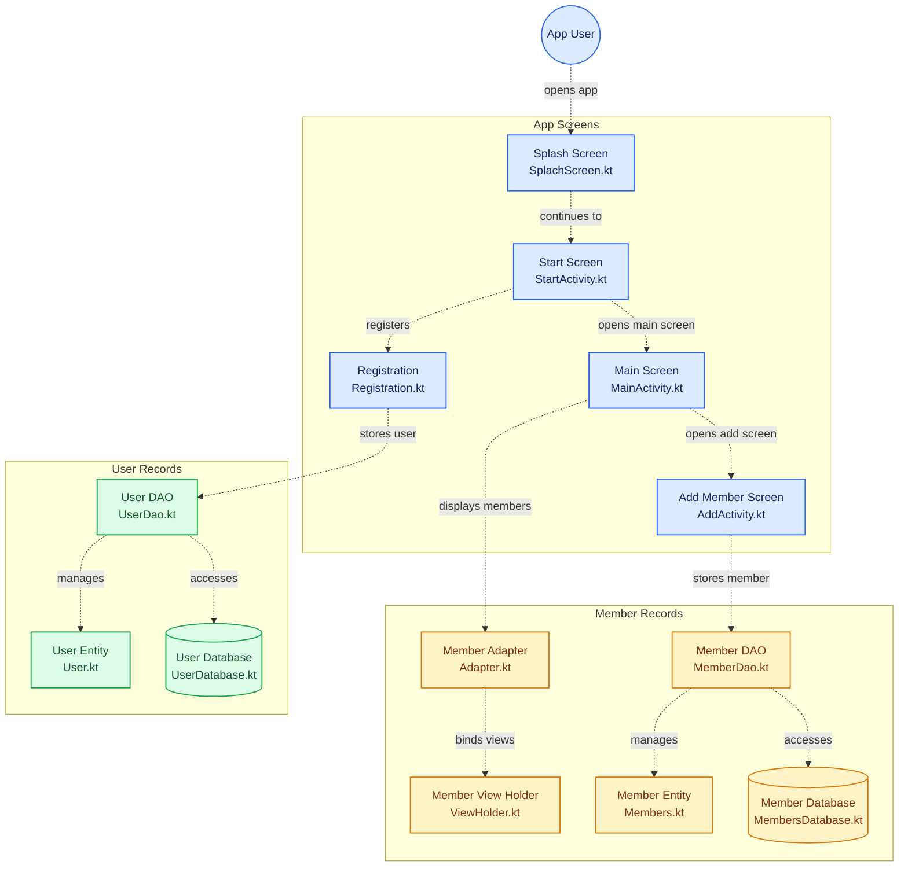

## Members Management System — Architecture

```mermaid id="m7x2pq"
flowchart TD

subgraph group_screens["App Screens"]
  node_splash["Splash Screen<br/>SplachScreen.kt"]
  node_start["Start Screen<br/>StartActivity.kt"]
  node_registration["Registration<br/>Registration.kt"]
  node_main["Main Screen<br/>MainActivity.kt"]
  node_add["Add Member Screen<br/>AddActivity.kt"]
end

subgraph group_members["Member Records"]
  node_adapter["Member Adapter<br/>Adapter.kt"]
  node_viewholder["Member View Holder<br/>ViewHolder.kt"]
  node_member["Member Entity<br/>Members.kt"]
  node_memberdao["Member DAO<br/>MemberDao.kt"]
  node_memberdb[("Member Database<br/>MembersDatabase.kt")]
end

subgraph group_users["User Records"]
  node_user["User Entity<br/>User.kt"]
  node_userdao["User DAO<br/>UserDao.kt"]
  node_userdb[("User Database<br/>UserDatabase.kt")]
end

node_person(("App User"))

node_person -.->|"opens app"| node_splash
node_splash -.->|"continues to"| node_start
node_start -.->|"registers"| node_registration
node_start -.->|"opens main screen"| node_main
node_main -.->|"opens add screen"| node_add
node_main -.->|"displays members"| node_adapter
node_adapter -.->|"binds views"| node_viewholder
node_add -.->|"stores member"| node_memberdao
node_memberdao -.->|"accesses"| node_memberdb
node_memberdao -.->|"manages"| node_member
node_registration -.->|"stores user"| node_userdao
node_userdao -.->|"accesses"| node_userdb
node_userdao -.->|"manages"| node_user

click node_splash "https://github.com/yassakamille/members_managment_system/blob/main/app/src/main/java/com/example/room/SplachScreen.kt"
click node_start "https://github.com/yassakamille/members_managment_system/blob/main/app/src/main/java/com/example/room/StartActivity.kt"
click node_registration "https://github.com/yassakamille/members_managment_system/blob/main/app/src/main/java/com/example/room/Registration.kt"
click node_main "https://github.com/yassakamille/members_managment_system/blob/main/app/src/main/java/com/example/room/MainActivity.kt"
click node_add "https://github.com/yassakamille/members_managment_system/blob/main/app/src/main/java/com/example/room/AddActivity.kt"
click node_adapter "https://github.com/yassakamille/members_managment_system/blob/main/app/src/main/java/com/example/room/rec/Adapter.kt"
click node_viewholder "https://github.com/yassakamille/members_managment_system/blob/main/app/src/main/java/com/example/room/rec/ViewHolder.kt"
click node_member "https://github.com/yassakamille/members_managment_system/blob/main/app/src/main/java/com/example/room/members/Members.kt"
click node_memberdao "https://github.com/yassakamille/members_managment_system/blob/main/app/src/main/java/com/example/room/members/MemberDao.kt"
click node_memberdb "https://github.com/yassakamille/members_managment_system/blob/main/app/src/main/java/com/example/room/members/MembersDatabase.kt"
click node_user "https://github.com/yassakamille/members_managment_system/blob/main/app/src/main/java/com/example/room/data/User.kt"
click node_userdao "https://github.com/yassakamille/members_managment_system/blob/main/app/src/main/java/com/example/room/data/UserDao.kt"
click node_userdb "https://github.com/yassakamille/members_managment_system/blob/main/app/src/main/java/com/example/room/data/UserDatabase.kt"

classDef toneNeutral fill:#f8fafc,stroke:#334155,stroke-width:1.5px,color:#0f172a
classDef toneBlue fill:#dbeafe,stroke:#2563eb,stroke-width:1.5px,color:#172554
classDef toneAmber fill:#fef3c7,stroke:#d97706,stroke-width:1.5px,color:#78350f
classDef toneMint fill:#dcfce7,stroke:#16a34a,stroke-width:1.5px,color:#14532d
classDef toneRose fill:#ffe4e6,stroke:#e11d48,stroke-width:1.5px,color:#881337
classDef toneIndigo fill:#e0e7ff,stroke:#4f46e5,stroke-width:1.5px,color:#312e81
classDef toneTeal fill:#ccfbf1,stroke:#0f766e,stroke-width:1.5px,color:#134e4a

class node_splash,node_start,node_registration,node_main,node_add,node_person toneBlue
class node_adapter,node_viewholder,node_member,node_memberdao,node_memberdb toneAmber
class node_user,node_userdao,node_userdb toneMint
```

